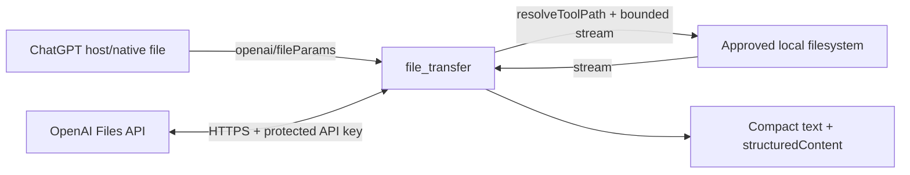

# First-party ChatGPT / OpenAI file-transfer bridge

Status: implementation contract and audit checklist; core v1 implementation is committed in `8c0f950` (`Add secure file transfer and native OpenCode Control`)

Scope: `localMCP-chat`

Primary goal: make file movement between ChatGPT/OpenAI-managed files and the approved local filesystem obvious, safe, and cheap for an agent to invoke without shell choreography, base64, temporary URLs in prompts, or bespoke per-call logic.

### Implementation status — 2026-09-11

Core v1 is implemented and committed:

- one permission-projected `file_transfer` built-in;
- ChatGPT-native `openai/fileParams` ingress;
- fixed-origin public OpenAI Files API get/list/content/upload client;
- streaming multipart upload with no Blob/base64/full-file materialization;
- streaming receive path with SHA-256, hard byte ceilings and idle/total deadlines;
- race-resistant approved-root source identity checks;
- same-directory exclusive partial files and atomic no-overwrite publication;
- distinct Receive vs Send-to-OpenAI capabilities, with outbound egress off by default;
- explicit ambiguous-upload classification and no blind mutation retry;
- control-window, deployment, README and model-instruction integration;
- tests for actual MCP `tools/list` projection of `_meta["openai/fileParams"]`.

Local verification covers TypeScript typecheck, the full Vitest suite, Electron production build, notice audit, privacy audit, and dependency audit. Live authenticated host/API round trips remain environment-dependent validation and are not replaced by mocked network tests.

## 1. Executive decision

Add one compact first-party MCP tool, provisionally named `file_transfer`, with explicit action names for the three materially different transfer lanes:

1. `save_chatgpt_file`
   - Source: a ChatGPT-native file value supplied through `_meta["openai/fileParams"]`.
   - Destination: an approved local path.
   - Authentication: none from localMCP. ChatGPT supplies a temporary authorized download reference for the current tool call.

2. `upload_openai_file`
   - Source: an approved local path.
   - Destination: the public OpenAI Files API for the OpenAI API project associated with the configured API key.
   - Authentication: localMCP's OpenAI API credential.
   - Default upload purpose: `user_data`.

3. `download_openai_file`
   - Source: a public OpenAI Files API `file-*` ID in the configured API project.
   - Destination: an approved local path.
   - Authentication: localMCP's OpenAI API credential.

Recommended read-only companion actions in the same tool:

4. `get_openai_file`
   - Retrieve metadata for one `file-*` object.

5. `list_openai_files`
   - Bounded discovery for files in the configured API project so an agent can locate an ID without telling the user to copy it manually.

Do **not** add deletion to v1. Deletion is a different destructive lifecycle operation and does not help the core transfer workflow. Add it later only with a separate explicit action and destructive confirmation semantics.

Do **not** claim that `upload_openai_file` attaches the uploaded object to the current ChatGPT conversation. A public Files API object and a ChatGPT conversation attachment are different integration surfaces. The public Files API guarantees a project-scoped `file-*` object. It does not document a server-side operation that inserts that object into the already-running ChatGPT consumer conversation.

## 2. The most important terminology rule

The implementation and tool descriptions must use precise names because there are three file namespaces in play.

### 2.1 ChatGPT-native file reference

A file selected, uploaded, generated, or otherwise available to the current ChatGPT host/runtime and passed to an MCP tool through OpenAI's file-parameter extension.

Runtime shape:

```json
{
  "download_url": "https://...",
  "file_id": "file_...",
  "mime_type": "image/png",
  "file_name": "input.png"
}
```

`download_url` and `file_id` are required by the current Apps/Plugins contract. `mime_type` and `file_name` are optional values but must be declared in the file-object schema.

The URL is temporary and belongs only to the current operation. Never persist it, log it, echo it to the model, put it in shell arguments, or treat it as a durable identifier.

### 2.2 OpenAI Files API object

A project-scoped object created through the public API:

```text
POST /v1/files
GET  /v1/files/{file_id}
GET  /v1/files/{file_id}/content
GET  /v1/files
```

This is the lane for explicit local-machine <-> OpenAI Platform file movement.

### 2.3 Local approved file

A file inside one of localMCP's configured approved roots. All source and destination paths continue to pass through the existing canonical sandbox. There is no implicit conversation directory and no bypass for native absolute paths.

## 3. Research findings that drive the design

### 3.1 OpenAI file params are the supported ChatGPT -> MCP ingress bridge

OpenAI's Apps/Plugins file handling contract uses a tool descriptor extension:

```json
{
  "_meta": {
    "openai/fileParams": ["source_file"]
  }
}
```

Each named field is a **top-level** input field. Nested file fields are not supported by the documented extension.

The complete file-object JSON Schema must declare:

```json
{
  "type": "object",
  "properties": {
    "download_url": { "type": "string" },
    "file_id": { "type": "string" },
    "mime_type": { "type": "string" },
    "file_name": { "type": "string" }
  },
  "required": ["download_url", "file_id"],
  "additionalProperties": false
}
```

The tool's `_meta["openai/fileParams"]` should contain `source_file` even though that field is only required for the `save_chatgpt_file` action.

This is materially better than asking the model to copy `/mnt/data/...`, invent a `file_id`, copy base64, or supply a URL in normal text. The host performs the file binding.

### 3.2 The old Chat On Steroids implementation already proved half of the design

The predecessor repository at commit `067c40d` contained `download_artifact`, which is direct prior art for `save_chatgpt_file`.

Relevant historical files:

- `src/main/mcp/tools-core.ts`
  - registered `download_artifact`
  - declared `_meta: { "openai/fileParams": ["file"] }`
  - accepted the native `{download_url,file_id,...}` object
- `src/main/mcp/artifact-fetch.ts`
  - validated the file-reference shape
  - bounded URL length
  - used manual redirects
  - revalidated every redirect
  - streamed the response rather than base64-inflating it
- `src/main/mcp/artifact-download.ts`
  - orchestrated resolve -> fetch -> bounded write -> hash -> publish
- `src/main/mcp/artifact-target.ts`
  - refused overwrite
  - staged into an owned partial
  - enforced size while writing
  - rechecked ownership before publication
- `src/main/mcp/instructions.ts`
  - explicitly instructed the model to use the native file-transfer tool instead of recreating generated files with shell/patch
- `src/main/session/recorder.ts`
  - deliberately redacted the native file credentials from durable history

Do not simply restore the old subsystem wholesale. Port the security properties into the current clean architecture and reuse the current `resolveToolPath()` / `resolvePath()` model.

### 3.3 OpenAI's current Codex implementation is strong prior art for local file -> OpenAI file

OpenAI's own Codex repository currently contains `codex-rs/core/src/mcp_openai_file.rs`.

Its documented strategy is:

1. inspect `_meta["openai/fileParams"]` to identify file arguments;
2. read local files from the primary environment;
3. upload them into OpenAI file storage;
4. rewrite only the declared file arguments into the downstream `{download_url,file_id,...}` shape.

It also performs a metadata/size check before reading and rejects files above the OpenAI upload limit.

That code runs on the **MCP client/agent side**, where Codex has OpenAI/ChatGPT authentication and owns the local execution environment. localMCP is on the opposite side of the MCP boundary, so it cannot blindly clone Codex's full mechanism. The useful architectural lessons are:

- file conversion belongs in a dedicated bridge layer;
- only declared file fields are rewritten;
- local paths stay local and file-reference credentials stay out of model text;
- size checks occur before the expensive body transfer;
- the data path is streaming, not base64.

### 3.4 Public Files API limits and semantics

Current public API documentation states:

- `POST /files` uploads a file;
- individual files can be up to 512 MB;
- a project can store up to 2.5 TB;
- upload is rate-limited independently;
- upload purposes include `assistants`, `batch`, `fine-tune`, `vision`, `user_data`, and `evals`;
- `user_data` is the flexible general-purpose choice;
- non-batch files persist until manually deleted unless an expiration policy is supplied;
- `GET /files/{file_id}/content` returns the file bytes.

For v1, default `purpose` to `user_data` and cap transfers at **512 MiB**, even if some surrounding transport could technically carry more.

### 3.5 MCP resource outputs are not equivalent to native ChatGPT attachments

Modern MCP tool results can contain:

- `resource_link` values;
- embedded text resources;
- embedded binary resources using base64 blobs and MIME types.

MCP Apps also defines a host-mediated `downloadFile` UI request for sandboxed app iframes.

Those are useful future surfaces for exporting files to a user, but they do not establish that a server-returned resource becomes a durable native attachment in the current ChatGPT conversation or public Files API project. Do not make v1 depend on undocumented client rendering behavior.

## 4. User experience contract

The model should never have to reason about temporary signed URLs, multipart form construction, curl, PowerShell `Invoke-WebRequest`, base64, or file-host allowlists.

Examples of intended prompts and model behavior:

### User has attached/generated a file in ChatGPT

User:

> Put this PDF at `/projects/example/research/source.pdf`.

Agent:

```json
{
  "action": "save_chatgpt_file",
  "source_file": "<host-bound native file>",
  "destination": "/projects/example/research/source.pdf"
}
```

No shell. No manual download URL.

### User wants a local file uploaded to the Platform Files API

User:

> Upload `research/results.csv` to OpenAI so we can reference it by file ID.

Agent:

```json
{
  "action": "upload_openai_file",
  "source": "/projects/example/research/results.csv",
  "purpose": "user_data"
}
```

Result should include the resulting `file_id`, filename, bytes, purpose, and expiry if present.

### User wants an API file copied to the machine

User:

> Download `file-abc123` into `/projects/example/assets/model-output.bin`.

Agent:

```json
{
  "action": "download_openai_file",
  "file_id": "file-abc123",
  "destination": "/projects/example/assets/model-output.bin"
}
```

## 5. Proposed MCP tool contract

Use **one** tool to preserve localMCP's compact tool-surface design.

Provisional name:

```text
file_transfer
```

Suggested title:

```text
Transfer files
```

Suggested description:

```text
Move files between ChatGPT/OpenAI file storage and approved local folders without shell or base64. save_chatgpt_file saves a ChatGPT-native file value to the computer; upload_openai_file uploads an approved local file to the OpenAI Files API; download_openai_file downloads a Files API file_id to an approved local path. Use get/list actions only to resolve Files API metadata or IDs. Never invent source_file values, signed URLs, or file IDs.
```

The exact schema should be generated from enabled capabilities so disabled transfer directions are absent from `action.enum`.

Conceptual input shape:

```ts
type FileTransferInput = {
  action:
    | 'save_chatgpt_file'
    | 'upload_openai_file'
    | 'download_openai_file'
    | 'get_openai_file'
    | 'list_openai_files';

  // ChatGPT-native ingress. Top-level because openai/fileParams requires it.
  source_file?: {
    download_url: string;
    file_id: string;
    mime_type?: string;
    file_name?: string;
  };

  // Local source for upload_openai_file.
  source?: string;

  // Local destination for save_chatgpt_file/download_openai_file.
  destination?: string;

  // Public Files API object for download/get.
  file_id?: string;

  // upload_openai_file; defaults to user_data.
  purpose?: 'assistants' | 'batch' | 'fine-tune' | 'vision' | 'user_data' | 'evals';

  // list_openai_files only.
  limit?: number;
  after?: string;
};
```

Tool metadata:

```json
{
  "_meta": {
    "openai/fileParams": ["source_file"]
  }
}
```

The current clean `tool()` helper in `src/clean/main/tools/registry.ts` only constructs `{name,description,inputSchema}`. Extend it so built-ins can intentionally carry standard `annotations` and `_meta` instead of special-casing `file_transfer` outside the normal registry path.

Because one tool contains external mutations and local writes, use conservative tool-level annotations:

```json
{
  "readOnlyHint": false,
  "destructiveHint": false,
  "idempotentHint": false,
  "openWorldHint": true
}
```

Do not incorrectly mark the whole multi-action tool read-only just because `get` and `list` are read-only.

## 6. Action validation

Do not rely on loose optional fields and then guess the operation from whichever fields happen to be present.

Validate per action in the handler:

| Action | Required | Must reject if missing |
| --- | --- | --- |
| `save_chatgpt_file` | `source_file`, `destination` | either field |
| `upload_openai_file` | `source` | source |
| `download_openai_file` | `file_id`, `destination` | either field |
| `get_openai_file` | `file_id` | file ID |
| `list_openai_files` | none | N/A |

Reject contradictory-only fields where useful, but do not overfit. A model may harmlessly include `purpose` with another action. The important invariant is that each action has one deterministic source and destination.

Use clear error prefixes such as:

```text
FILE_TRANSFER_INVALID_INPUT
FILE_TRANSFER_DISABLED
FILE_TRANSFER_SOURCE_CHANGED
FILE_TRANSFER_DESTINATION_EXISTS
FILE_TRANSFER_TOO_LARGE
FILE_TRANSFER_CHATGPT_REFERENCE_INVALID
FILE_TRANSFER_OPENAI_AUTH_REQUIRED
FILE_TRANSFER_OPENAI_AUTH_FAILED
FILE_TRANSFER_OPENAI_NOT_FOUND
FILE_TRANSFER_OPENAI_RATE_LIMITED
FILE_TRANSFER_REMOTE_FAILED
FILE_TRANSFER_LOCAL_WRITE_FAILED
```

Keep errors actionable but never include bearer tokens, signed URLs, or arbitrary response bodies.

## 7. Permissions and capability model

File transfer deserves explicit authority. Do not hide it under generic `read`, `write`, or `shell` alone.

Recommended additions to `ToolPermissions`:

```ts
filesReceive: boolean; // remote/ChatGPT/OpenAI -> local
filesSend: boolean;    // local -> OpenAI
```

Effective action requirements:

```text
save_chatgpt_file:
  filesReceive && write

download_openai_file:
  filesReceive && write

get_openai_file:
  filesReceive || filesSend

list_openai_files:
  filesReceive || filesSend

upload_openai_file:
  filesSend && read
```

Why two dedicated flags:

- `filesSend` is an explicit data-egress capability. A read-only local filesystem grant should not silently imply permission to transmit file contents to a remote API.
- `filesReceive` writes bytes into the approved workspace and deserves an explicit switch even though the existing write sandbox remains the destination authority.
- The model-facing `action` enum can omit disabled directions, reducing mistakes and unnecessary confirmation prompts.

Recommended defaults for new installs:

- `filesReceive: true`
- `filesSend: false`

Rationale: receiving a user/ChatGPT file into an already-approved write root is the lower-surprise capability. Sending arbitrary approved-root files to a remote service is egress and should be opt-in.

If product policy prefers existing "everything enabled" behavior, `filesSend` may default on, but the UI copy must make the egress explicit. Do not accidentally enable it only through config migration.

### Control-window copy

Add two dense capability rows under the current Capabilities panel:

```text
Receive files
Save ChatGPT/OpenAI files into approved folders. Still requires local write access.

Send files to OpenAI
Upload files from approved folders to the OpenAI Files API. Still requires local read access.
```

The Published surface should continue to show only one `file_transfer` tool.

## 8. Credentials

### 8.1 ChatGPT-native ingress must not use the OpenAI API key

`save_chatgpt_file` consumes the host-authorized `download_url` supplied in `source_file`.

Never attach the local OpenAI API key to that request. A signed ChatGPT file URL is already the capability for that object. Sending the API key to a file CDN would create unnecessary credential exposure.

### 8.2 Public Files API actions use the existing protected OpenAI credential

The repository already has:

- `getOpenAiApiKey()`;
- process-only `LOCALMCP_OPENAI_API_KEY` / `_FILE` overrides;
- Electron `safeStorage` persistence;
- DPAPI-backed storage on Windows;
- guarded Linux behavior that rejects Chromium's insecure `basic_text` fallback.

For v1, reuse this credential for public Files API calls. Do not create a second required secret unless there is a demonstrated need for a separate project/key.

This choice must be explicit in UI/help text:

> OpenAI Files actions use the same protected OpenAI API key configured for this localMCP instance. The key must have access to the target OpenAI API project and Files API.

Handle 401/403 as a Files API authorization failure. Do not automatically replace, rotate, or print the key.

Future extension if project separation becomes necessary:

```text
LOCALMCP_OPENAI_FILES_API_KEY
LOCALMCP_OPENAI_FILES_API_KEY_FILE
secret key: openaiFilesApiKey
```

but do not widen v1 without need.

## 9. Data-plane architecture

Recommended module layout:

```text
src/clean/main/tools/file-transfer.ts
src/main/files/chatgpt-file-reference.ts
src/main/files/openai-files-client.ts
src/main/files/local-file-source.ts
src/main/files/local-file-target.ts
```

The names are illustrative. Keep protocol/client code separate from local filesystem ownership logic.



### Layer responsibilities

#### `file-transfer.ts`

- action validation;
- permission checks;
- resolve input/output path requests;
- dispatch to one narrow data-plane function;
- compose model-facing output;
- metrics/outcome classification.

#### `chatgpt-file-reference.ts`

- validate the host-injected object;
- validate temporary download URL shape;
- perform bounded, redirect-safe streaming fetch;
- never know about approved roots.

#### `openai-files-client.ts`

- strict fixed API origin;
- bearer auth from `getOpenAiApiKey()`;
- upload multipart streaming;
- retrieve metadata;
- retrieve content streaming;
- bounded list;
- normalize OpenAI HTTP errors into non-secret internal errors;
- never know about localMCP model-facing paths.

#### `local-file-source.ts`

- resolve/canonicalize source;
- require regular file;
- obtain stable metadata before upload;
- enforce max size before opening body;
- stream exact bytes;
- detect source changes where practical.

#### `local-file-target.ts`

- resolve destination with `allowMissing` only for the terminal component;
- require an existing real parent directory;
- reject symlink/junction escape;
- use an owned same-directory temp file;
- bound byte count while streaming;
- compute SHA-256 during the stream;
- verify expected byte count when known;
- atomically publish only after successful close/verification;
- clean the temp on cancellation/failure;
- default to no overwrite.

## 10. Local source invariants

For `upload_openai_file`:

1. Resolve with `resolveToolPath(roots, source)`.
2. `lstat` / metadata must identify a regular file.
3. Do not follow a terminal symlink as a source file if the current sandbox does not already prove it canonical and contained.
4. Reject files greater than 512 MiB before starting HTTP upload.
5. Snapshot at least:
   - real path;
   - size;
   - mtime;
   - inode/file ID when readily available.
6. Stream from an open handle.
7. If upload construction allows a post-read source verification, ensure the file did not change before reporting a clean success.

Do not read a 512 MiB file into `Buffer`, `Uint8Array`, or base64 just to construct multipart form data.

## 11. Local destination invariants

For both receive actions:

1. Resolve destination with the current sandbox using `allowMissing: true`.
2. Parent directory must already exist.
3. Parent must be a real directory and remain within the approved root after canonicalization.
4. Destination must not already exist in v1.
5. Stream into a unique partial in the destination directory.
6. Enforce the 512 MiB ceiling while writing even if remote metadata lied or omitted `Content-Length`.
7. Maintain exact byte count and SHA-256 incrementally.
8. If metadata provided an expected byte count, require an exact match.
9. Flush/close successfully before publication.
10. Atomically rename/link into the final destination only if it is still free.
11. Delete the owned partial on every failure/cancel path.

The old `artifact-target.ts` implementation is useful prior art for race resistance. Port the invariants, not its old session assumptions.

## 12. ChatGPT-native reference validation

Treat `_meta["openai/fileParams"]` as a strong host integration signal, but do not treat an object with the right keys as magical provenance.

Minimum object validation:

```text
download_url: non-empty string, bounded length
file_id: non-empty string, bounded length, no control characters
mime_type: optional bounded string
file_name: optional bounded string
no unexpected giant nested data
```

URL policy:

- HTTPS only;
- no username/password;
- no fragment;
- default/443 port only;
- manual redirect handling;
- maximum 3 redirects;
- revalidate every redirected URL;
- request timeout;
- no OpenAI API `Authorization` header;
- never put the URL in an error or log.

The historical implementation used an exact hostname allowlist including `files.oaiusercontent.com` and one OpenAI image-generation Azure host. Keep an exact-host strategy if tests against current ChatGPT confirm those hosts, but isolate the allowlist in one module because OpenAI does not make the CDN hostname part of the semantic `fileParams` contract. A future regional host should require an intentional code update, not a wildcard such as `*.blob.core.windows.net`.

Do not accept arbitrary user/model URLs through `save_chatgpt_file`. That would turn a file convenience tool into an SSRF/download primitive.

## 13. Public OpenAI Files API client

Use the fixed origin:

```text
https://api.openai.com/v1
```

Do not expose a model-settable base URL. Do not send the API key to arbitrary endpoints.

Required methods:

```ts
uploadFile(source, { purpose, signal }): Promise<OpenAIFileMetadata>
getFile(fileId, { signal }): Promise<OpenAIFileMetadata>
downloadFile(fileId, { signal }): Promise<{ metadata, stream, contentLength? }>
listFiles({ limit, after, purpose?, signal }): Promise<...>
```

### Upload implementation

Use `multipart/form-data` with:

- `file`: the streaming local file body;
- `purpose`: explicit enum, default `user_data`.

Avoid adding the full OpenAI SDK solely for five small Files API methods unless it materially improves streaming correctness or authentication behavior. The project already uses native HTTP/fetch infrastructure and benefits from a small packaged dependency surface.

If native `FormData` would buffer the complete file in this Electron/Node runtime, do not use it. Implement or use a streaming multipart encoder whose memory footprint is O(chunk size), not O(file size).

The implementation agent must measure this with a large sparse/test file and record the memory result in tests or the PR notes.

### Download implementation

Prefer:

1. `GET /files/{file_id}` for metadata;
2. reject metadata size above local limit;
3. `GET /files/{file_id}/content` for bytes;
4. stream to `local-file-target`;
5. compare bytes written to API metadata where available.

This extra metadata request is worth the safety and filename/size UX.

### List implementation

Keep it intentionally bounded.

Suggested v1 inputs:

```text
limit: 1..100, default 20
after: optional cursor/file id accepted by the API
purpose: optional supported purpose filter if the API supports it in the current schema
```

Return a compact set of fields only:

```text
id
filename
bytes
purpose
created_at
expires_at if present
```

Do not dump a large project file catalog into the model context.

## 14. Output contract

Every successful mutation should have one short text sentence plus structured output.

### `save_chatgpt_file`

Text:

```text
Saved /presgen/research/source.pdf (12.4 MB, sha256: abc123...).
```

Structured:

```json
{
  "action": "save_chatgpt_file",
  "path": "/presgen/research/source.pdf",
  "bytes": 13002342,
  "sha256": "...",
  "source_file_id": "file-..."
}
```

### `upload_openai_file`

Text:

```text
Uploaded /presgen/research/results.csv to OpenAI as file-abc123 (user_data, 4.2 MB).
```

Structured:

```json
{
  "action": "upload_openai_file",
  "source": "/presgen/research/results.csv",
  "file_id": "file-abc123",
  "filename": "results.csv",
  "bytes": 4404019,
  "purpose": "user_data",
  "created_at": 0,
  "expires_at": null
}
```

### `download_openai_file`

Structured:

```json
{
  "action": "download_openai_file",
  "file_id": "file-abc123",
  "path": "/presgen/assets/output.bin",
  "bytes": 1234,
  "sha256": "...",
  "filename": "original-name.bin",
  "purpose": "user_data"
}
```

Never return a signed `download_url` unless a future interoperable protocol explicitly requires it. The agent should reason in durable IDs and local virtual paths.

## 15. Logging and telemetry

Safe log fields:

- action;
- virtual local path;
- byte count;
- duration;
- success/failure class;
- purpose;
- optionally a short non-secret file-ID prefix or hash for correlation.

Never log:

- API key;
- `Authorization` header;
- ChatGPT `download_url`;
- full query strings from signed URLs;
- multipart body;
- file content;
- arbitrary upstream error body without redaction/bounds.

Extend existing metrics at the tool boundary; do not create a second metrics subsystem.

Useful internal measurements:

```text
transfer bytes
transfer duration
effective MiB/s
direction
source type: chatgpt_native | openai_api | local
```

Do not publish those extra fields to ChatGPT unless they help the current task.

## 16. Retry and ambiguity policy

### Downloads

It is safe to retry network setup before any local publication, but the implementation should still avoid automatic broad retries. Signed ChatGPT URLs are temporary, and repeated retrieval may produce a different URL for the same `file_id`.

If the final destination already exists, do not overwrite it automatically.

### Uploads

`POST /files` creates external state and may succeed even if the client loses the response.

Therefore:

- do not automatically retry after request-body transmission has begun;
- on an ambiguous transport failure, return a distinct error explaining that the upload may have completed;
- instruct the agent to inspect/list recent files before retrying;
- do not silently deduplicate by filename because duplicate filenames are valid;
- do not pretend local SHA-256 maps to an OpenAI server-side checksum unless the API exposes one.

This follows localMCP's existing rule for ambiguous external-tool mutation failures: inspect state before retrying.

## 17. Cancellation and timeout behavior

Every lane should accept an `AbortSignal` internally.

Suggested defaults:

- connection/header timeout: 30 seconds;
- overall tool timeout: rely on the surrounding MCP server's 300-second request ceiling but abort earlier when practical;
- large transfer progress is not streamed to the model in v1.

On abort:

- close local file handles;
- cancel fetch/body streams;
- remove owned temp targets;
- do not publish a partial destination;
- do not report success from metadata alone.

## 18. Security threat model

### Threat: model turns the ingress tool into arbitrary URL fetch/SSRF

Mitigation:

- source is a dedicated file-param object, not a URL string;
- HTTPS-only URL validation;
- exact host policy where currently validated;
- manual redirects and revalidation;
- no private/local-network URL fallback.

### Threat: path escape through symlink/junction

Mitigation:

- use current `resolvePath()` canonical containment logic;
- recheck destination parent before publication;
- same-directory temp publication.

### Threat: remote response exceeds declared size

Mitigation:

- byte counter enforces hard max while streaming;
- metadata `size`/`Content-Length` are only preflight hints, not authority.

### Threat: malicious filename from remote metadata

Mitigation:

- do not implicitly derive destination path from remote filename in v1;
- caller supplies an approved destination path;
- remote filename is presentation metadata only.

### Threat: local data exfiltration through convenience tool

Mitigation:

- explicit `filesSend` capability;
- existing approved-root read boundary;
- conservative MCP write/open-world annotations;
- no arbitrary URL destinations.

### Threat: API key leaks to file CDN or logs

Mitigation:

- API key used only for fixed `api.openai.com/v1` client;
- ChatGPT-native signed URL client never receives auth headers;
- redacted/bounded errors.

### Threat: duplicate tool invocation creates duplicate OpenAI files

Mitigation:

- no blind retry;
- ambiguous-success error classification;
- bounded list/get actions for reconciliation.

## 19. Current repository integration points

### Tool registry

`src/clean/main/tools/registry.ts`

- add a generated `fileTransferDefinition(config)`;
- extend `tool()` helper to accept metadata/annotations cleanly;
- reserve `file_transfer` in `BUILTINS`;
- expose only if at least one file capability is enabled and its dependent read/write capability is available;
- dispatch to `fileTransferTool()` before plugin fallback.

### MCP endpoint

`src/clean/main/mcp.ts`

No special transport is expected. `tools/list` already projects tool definitions and `tools/call` already projects results. Add tests proving `_meta["openai/fileParams"]` survives the exact server projection ChatGPT sees.

Do not assume this merely because TypeScript's `Tool` type allows `_meta`.

### Configuration

`src/clean/main/state.ts`

- add the two permission fields;
- define migration/default behavior deliberately;
- maintain fail-closed parsing for malformed values.

### Renderer

`src/clean/renderer/views.ts`

- add permission rows;
- keep copy clear that `Send files to OpenAI` is network egress;
- no new large settings page is required.

### Secrets

`src/main/secrets.ts`

- reuse `getOpenAiApiKey()` for public Files API actions;
- do not weaken its runtime/file/DPAPI rules;
- no new renderer IPC returning plaintext secrets.

### Sandbox

`src/main/sandbox.ts`
`src/clean/main/tools/common.ts`

- use `resolveToolPath()` and current `resolvePath()` semantics;
- never add a file-transfer-specific raw path fallback.

### Historical reference

Use Git to inspect commit `067c40d` when implementing the receive side. The useful code was intentionally removed from the clean fork, but remains in repository history.

## 20. Suggested implementation phases

### Phase A: schema and permission plumbing

1. Extend tool descriptor helper for `_meta` and annotations.
2. Add `filesReceive` / `filesSend` config fields and UI toggles.
3. Add `file_transfer` definition with dynamic action enum.
4. Add MCP projection test proving `openai/fileParams` reaches `tools/list` unchanged.

Exit criterion: ChatGPT can discover a valid file-param-enabled tool even before transfer handlers are wired.

### Phase B: ChatGPT-native -> local

1. Port/refactor old CoS reference validator.
2. Port/refactor race-safe target writer.
3. Add `save_chatgpt_file` action.
4. Verify with a real ChatGPT attached file and a ChatGPT-generated file.

Exit criterion: native attached/generated file saves byte-for-byte into an approved folder without shell/base64.

### Phase C: public Files API client

1. Implement fixed-origin authenticated client.
2. Implement metadata get/list.
3. Implement streaming content download.
4. Wire `download_openai_file`.

Exit criterion: known `file-*` objects round-trip from API project to local filesystem with hash/size verification.

### Phase D: local -> public Files API

1. Implement stable local source abstraction.
2. Implement streaming multipart body.
3. Wire `upload_openai_file`.
4. Verify memory remains bounded with a large file.
5. Verify ambiguous upload failures are not blindly retried.

Exit criterion: local file uploads as `user_data` and resulting `file_id` can be downloaded through Phase C to identical SHA-256.

### Phase E: end-to-end UX hardening

1. Real ChatGPT invocation tests.
2. Permission on/off tests.
3. Error wording cleanup.
4. README/docs update.
5. Packaged Windows smoke test.

## 21. Required tests

### Schema/projection

- `file_transfer` appears only when effective permission exists.
- action enum reflects effective directions.
- `source_file` schema declares all four OpenAI fields.
- required properties inside file object are exactly `download_url` and `file_id`.
- `_meta["openai/fileParams"]` equals `["source_file"]` in actual `tools/list` response.
- tool fingerprint changes when file permission/tool schema changes.

### ChatGPT ingress reference

- malformed object rejected;
- empty/control-character file ID rejected;
- non-HTTPS URL rejected;
- credentials in URL rejected;
- forbidden host rejected if exact allowlist is used;
- redirect to forbidden host rejected;
- more than redirect limit rejected;
- timeout aborts;
- signed URL never appears in returned error.

### Local target

- destination outside root rejected;
- symlink/junction escape rejected;
- missing parent rejected;
- existing destination rejected;
- stream larger than limit rejected and partial removed;
- content-length/metadata mismatch rejected;
- hash computed over exact published bytes;
- interruption leaves no final file;
- concurrent publication cannot overwrite a file created by another actor.

### Local source

- outside-root source rejected;
- directory rejected;
- oversized file rejected before HTTP body begins;
- source changing during transfer does not report clean success;
- memory does not scale linearly with file size.

### OpenAI client

- API key never included for ChatGPT-native CDN request;
- API key included only for exact OpenAI API origin;
- 401/403 mapped to auth error;
- 404 mapped to not-found;
- 413/oversize handled clearly;
- 429 mapped to rate-limited without immediate automatic retry;
- 5xx bounded/redacted;
- invalid JSON metadata response fails closed;
- content response is streamed;
- list pagination bounded.

### Upload ambiguity

- failure before body transmission can be clean failure;
- socket loss after body begins returns an "outcome may be ambiguous" class;
- tool does not auto-run a second upload.

### Round trip

Create a deterministic binary fixture, then:

```text
local fixture
  -> upload_openai_file
  -> file_id
  -> download_openai_file
  -> local copy
```

SHA-256 and byte length must match.

## 22. Performance requirements

This feature should be limited by disk/network throughput, not JavaScript object churn.

Requirements:

- O(chunk-size) transfer memory;
- no base64 on public API upload/download lane;
- no full-file `Buffer.concat`;
- no duplicate pass over the file solely to compute SHA-256 before upload;
- for downloads, hash while writing;
- reuse HTTP connection pooling where the runtime already provides it;
- avoid adding a heavyweight SDK if small fetch helpers are sufficient;
- bound list output and upstream error bodies.

Recommended benchmark fixture sizes:

```text
1 MiB
64 MiB
256 MiB
near-limit sparse/real fixture where CI environment permits
```

Record:

```text
wall time
peak RSS delta
MiB/s
bytes transferred
```

The important regression gate is that peak memory must not approach file size.

## 23. Agent guidance to add to localMCP instructions

Keep this compact because it becomes model context.

Suggested addition:

```text
- file_transfer: use for real file movement instead of shell/base64. save_chatgpt_file accepts only a ChatGPT-native source_file injected through the file parameter and writes it to an approved path. upload_openai_file sends an approved local file to the OpenAI Files API and returns its file_id. download_openai_file saves a Files API file_id into an approved path. Never invent file references, signed URLs, or file IDs, and do not retry an ambiguous upload before inspecting remote state.
```

Do not tell the agent that a public Files API upload becomes attached to the current chat.

## 24. Future extension: native file manifestation back into ChatGPT

This is deliberately **not** part of v1, but the implementation should leave room for it.

Potential standards-aligned directions to investigate:

1. MCP `resource_link` result for an exported local file plus a server `resources/read` implementation.
2. MCP Apps host-mediated `downloadFile` request from a minimal localMCP widget.
3. A future standardized MCP file primitive if the current proposals around first-class file content become widely implemented.
4. A documented OpenAI host API that accepts an MCP tool result and creates a ChatGPT-native file reference.

Acceptance criterion for any future "manifest into ChatGPT" feature:

> A file returned from localMCP appears as an actual host-managed file/reference that a later ChatGPT turn or another `openai/fileParams` tool can consume without the model copying bytes/URLs manually.

Do not call a normal clickable URL, base64 resource, or public `/v1/files` object "manifested into the chat" unless this criterion is demonstrated end-to-end.

## 25. Explicit non-goals for v1

- arbitrary URL downloader;
- arbitrary HTTP uploader;
- S3/GDrive/Dropbox transfer abstraction;
- folders/directories as one transfer input;
- recursive archive creation before upload;
- automatic overwrite;
- OpenAI file deletion;
- vector-store ingestion;
- attaching a public Files API object into the current ChatGPT UI;
- persistent caching of ChatGPT signed URLs;
- storing API keys in config or renderer state;
- using shell/curl as the implementation backend.

## 26. Definition of done

The implementation is complete when all of the following are true:

1. `file_transfer` is a first-party built-in tool with a valid ChatGPT file-param declaration.
2. An agent can save a ChatGPT-native attached/generated file into an approved root in one tool call.
3. An agent can upload an approved local file to the public OpenAI Files API in one tool call and receive a durable `file_id`.
4. An agent can download a public Files API `file_id` into an approved root in one tool call.
5. Transfer memory is bounded and no file lane uses base64 for bulk bytes.
6. Local destination publication is atomic and no partial file is exposed as success.
7. Existing approved-root, OS-secret-storage, and plugin security boundaries are preserved.
8. Signed URLs/API keys never appear in logs, tool text, structured output, or durable state.
9. Upload ambiguity is handled without blind retry.
10. The implementation does not claim public API upload equals current ChatGPT conversation attachment.
11. Typecheck, unit tests, build, and packaged Windows smoke tests pass.
12. Real ChatGPT validation confirms `_meta["openai/fileParams"]` works through the current Secure MCP Tunnel path.

## 27. Research references

OpenAI / official:

- OpenAI Files API, upload: `https://developers.openai.com/api/reference/typescript/resources/files/methods/create`
- OpenAI Files API, retrieve content: `https://developers.openai.com/api/reference/typescript/resources/files/methods/content`
- OpenAI Files API resource overview: `https://developers.openai.com/api/reference/cli/resources/files`
- OpenAI Codex file-param bridge: `https://github.com/openai/codex/blob/main/codex-rs/core/src/mcp_openai_file.rs`
- ChatGPT developer mode / MCP apps: `https://help.openai.com/en/articles/12584461-developer-mode-and-full-mcp-connectors-in-chatgpt-beta`

MCP / current ecosystem:

- MCP TypeScript SDK resource-link and binary resource documentation: `https://ts.sdk.modelcontextprotocol.io/server`
- MCP Apps `downloadFile` host bridge: `https://apps.extensions.modelcontextprotocol.io/api/classes/app.App.html`

Repository-local prior art:

- Git commit `067c40d` from upstream Chat On Steroids
- historical `src/main/mcp/tools-core.ts`
- historical `src/main/mcp/artifact-fetch.ts`
- historical `src/main/mcp/artifact-download.ts`
- historical `src/main/mcp/artifact-target.ts`
- current `src/clean/main/tools/registry.ts`
- current `src/clean/main/mcp.ts`
- current `src/clean/main/state.ts`
- current `src/main/secrets.ts`
- current `src/main/sandbox.ts`
- current `src/clean/main/tools/common.ts`

## 28. Implementation instruction to the next agent

Treat this document as the architecture contract, not as permission to cut corners around the current clean fork.

Before editing:

1. inspect the current worktree and do not disturb unrelated uncommitted work;
2. read `AGENTS.md`;
3. inspect the historical CoS files at `067c40d` for security invariants only;
4. inspect the current OpenAI Codex `mcp_openai_file.rs` for file-param bridge behavior;
5. confirm the current OpenAI Files API request/response schema from official docs at implementation time.

During implementation:

- keep the MCP surface compact;
- prefer one coherent first-party tool;
- stream bytes;
- preserve the approved-root and secure-secret boundaries;
- write tests as each data-plane layer is added;
- treat upload retry ambiguity as a correctness issue, not a UX nuisance;
- verify the exact schema ChatGPT receives rather than assuming local TypeScript shape equals remote projection.

Before handoff:

- run targeted tests while developing;
- run full `npm run verify`;
- run privacy/notices checks if dependencies or public history change;
- inspect the final diff for accidental URL/token logging;
- perform at least one real Secure MCP Tunnel invocation in ChatGPT with a native file parameter;
- report measured memory/throughput for a large upload and download;
- document any ChatGPT client-specific limitation observed on web/mobile rather than adding an undocumented workaround.
