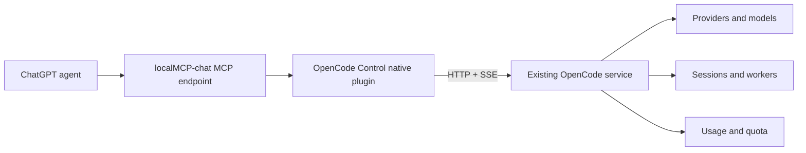
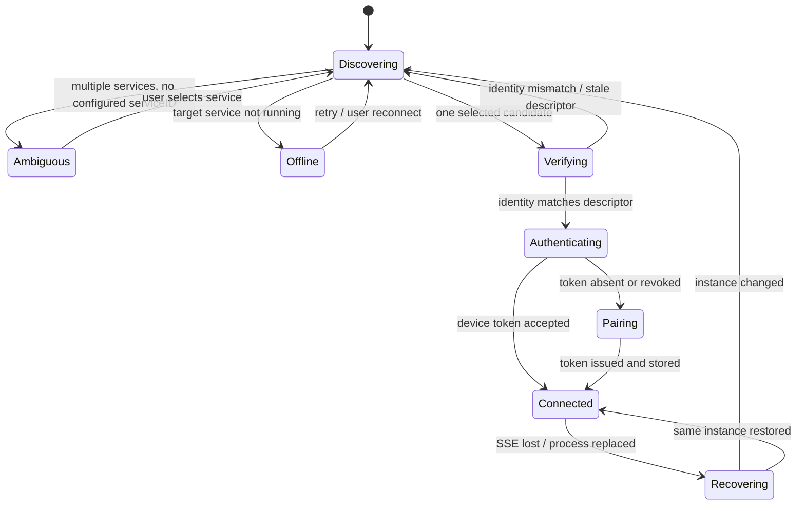
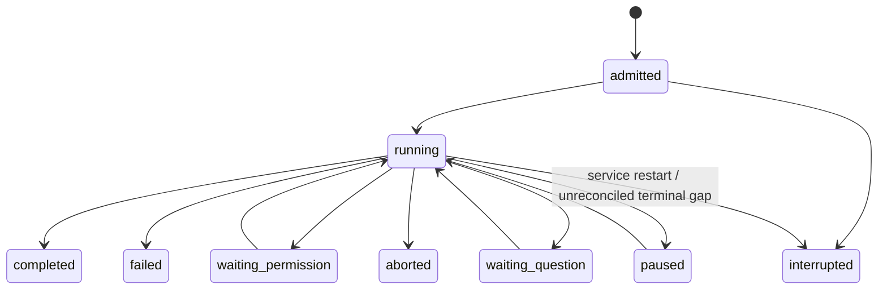

# OpenCode Control Integration Architecture

Status: fleshed-out prototype committed in localMCP `8c0f950`, with narrow OpenCode compatibility already present in the workstation fork's pushed `main`. Service auto-discovery remains a later phase; the prototype intentionally uses an explicit loopback OpenCode URL.

## 1. Goal

Add a first-party OpenCode integration to localMCP-chat so ChatGPT agents can control the OpenCode service running on the same machine without recreating OpenCode, scraping its UI, reading its database directly, or spawning one OpenCode CLI process per delegated task.

The integration should support at minimum:

- discovering and attaching to the intended local OpenCode service;
- listing providers, models, agents, service capabilities, historical usage, and provider quota windows;
- listing and reading existing OpenCode sessions;
- sending turns to authorized existing sessions;
- pausing, resuming, aborting, and inspecting session children;
- launching durable background OpenCode worker sessions;
- waiting for and reading worker results without busy polling;
- recovering workers after localMCP-chat restarts;
- surfacing pending permission and question requests;
- cancelling worker-owned execution without leaking pending requests;
- preserving a small, stable MCP schema so provider/model/session churn does not destroy prompt caching.

This is an agent-control integration, not a second OpenCode UI.

### 1.1 Implemented prototype snapshot

The current prototype keeps the model-facing surface fixed at four tools:

```text
opencode_info
opencode_session
opencode_worker
opencode_request
```

Runtime state does not add or remove these schemas. OpenCode can restart, providers can change, models can change, and workers/swarms can come and go without causing MCP tool-list churn.

Implemented behavior includes:

- explicit loopback OpenCode attachment with instance pinning on every request;
- one-time password to revocable device-token pairing, with the durable token stored by localMCP's existing protected plugin credential path;
- one global SSE stream used as a wake-up channel while snapshots remain authoritative;
- approved-root filtering for every exposed or controlled OpenCode session;
- provider, model, agent, quota, and project-scoped usage inspection;
- OpenSwarm-inspired live model normalization, including provider aliases, model-ID/display-name resolution, cross-provider family matching, capability/cost metadata, and dynamic reasoning variants;
- explicit persistent `selection` / `set_selection` session operations for agent, provider, model, and reasoning variant;
- durable standalone workers backed by OpenCode session metadata plus a plugin-owned ownership group;
- durable localMCP worker batches exposed through the `swarm_*` actions, backed by the same global ownership group plus one plugin-owned OpenCode session group per batch;
- restart recovery from OpenCode itself, with no localMCP worker or swarm database;
- permission/question mediation and cancellation cleanup;
- event-driven bounded waits correlated by caller-chosen user-message IDs and assistant `parentID`;
- an injected per-turn OpenCode system context that tells the model it is a delegated ChatGPT sub-agent rather than a human-facing primary agent.

LocalMCP `swarm_*` actions are deliberately modeled after multiple independent OpenCode `task` calls, not after OpenSwarm's autonomous coordination runtime. ChatGPT is the only coordinator: each member gets a complete standalone assignment, members do not receive peer rosters or mailboxes, and localMCP provides only durable grouping plus aggregate inspection/wait/cancel/continue. The group exists for recovery and control, not as model-visible collaboration state. LocalMCP and OpenSwarm therefore remain separate orchestration domains. Every session created by localMCP receives an OpenCode permission rule denying `swarm_*`, so a ChatGPT delegated worker cannot recursively create an OpenSwarm swarm. Existing OpenSwarm member sessions are still visible and controllable through `opencode_session` when their directories are inside approved localMCP roots. Merely controlling such a session does not adopt it into localMCP ownership or rewrite its permissions.

The only OpenCode core change required by the current prototype is extending the existing `PATCH /session/:id` contract with optional `agent` and `model { providerID, id, variant }`. OpenCode validates the agent, provider/model, and published variant before persisting the selection with its existing `Session.setAgentModel` path. No second control server or database is introduced.

## 2. Architectural conclusion

The primary control boundary should be OpenCode's HTTP API and event stream.



Do not use ACP as the main transport to OpenCode. OpenCode's ACP implementation already translates ACP calls into its SDK and HTTP API, then translates OpenCode events back into ACP events. Routing localMCP-chat through ACP would therefore add an unnecessary protocol layer and hide OpenCode-specific functions such as quota, usage analytics, session groups, and native background-subagent controls.

ACP remains a useful design reference for:

- session lifecycle semantics;
- model and mode selection;
- cancel semantics;
- event-to-session routing;
- run-until-idle behavior;
- reconnect behavior.

T3 Code and OpenChamber are useful host-layer references. Their strongest applicable ideas are provider isolation, explicit server ownership, event normalization, bounded reads, request cancellation, and snapshot recovery. Their heavier cross-provider orchestration layers are not needed for a single first-party OpenCode integration.

## 3. Non-goals

The first implementation should not:

- automate the OpenCode Electron UI;
- inspect or mutate `opencode.db` directly;
- create a second localMCP orchestration database for worker truth;
- start one OpenCode server for every worker;
- create one localMCP MCP tool per model, provider, agent, or session;
- mutate the MCP tool schema when OpenCode connects, disconnects, changes models, or changes providers;
- proxy arbitrary OpenCode HTTP routes through a generic `opencode_call` tool;
- silently attach to whichever loopback port happens to answer first;
- retain OpenCode's master server password as the integration credential;
- automatically stop OpenCode when localMCP-chat exits;
- implicitly authorize OpenCode worktrees that live outside localMCP-chat's approved roots;
- reimplement OpenCode's native `task` and `BackgroundJob` scheduler.

## 4. Why HTTP instead of ACP

OpenCode's own ACP server is implemented on top of the same SDK and HTTP surface that localMCP-chat can call directly.

Conceptually, the two choices are:

```text
localMCP -> ACP -> OpenCode SDK/HTTP -> OpenCode
```

or:

```text
localMCP -> OpenCode HTTP/SSE -> OpenCode
```

The direct path is shorter and preserves OpenCode-specific capabilities.

The integration should therefore borrow ACP's lifecycle discipline without adopting ACP as an extra transport layer.

## 5. Why this should be a native localMCP plugin

The user-facing unit should still be a plugin named something like `OpenCode Control`, but its implementation should run as a first-party native plugin backend inside localMCP-chat rather than as an arbitrary npm MCP child process.

Reasons:

1. The integration needs live access to localMCP-chat approved roots.
2. It should reuse localMCP-chat's DPAPI-backed secret storage.
3. It needs one long-lived SSE connection rather than reconnecting per tool call.
4. It needs connector identity for worker ownership and device naming.
5. It should not add an avoidable stdio MCP hop for high-frequency session control.
6. It needs stable tool exposure even while OpenCode is temporarily offline.
7. It should be able to reconcile plugin lifecycle and OpenCode lifecycle without pretending localMCP owns the OpenCode process.

The plugin framework should gain a compiled first-party backend concept rather than special-casing OpenCode throughout the MCP registry.

Proposed shape:

```ts
type PluginBackendDescriptor =
  | { kind: "mcp"; /* current installed launch descriptor */ }
  | { kind: "native"; id: "opencode-control" }

interface NativePluginBackend {
  readonly tools: readonly Tool[]
  start(): Promise<void>
  stop(): Promise<void>
  call(name: string, args: Record<string, unknown>): Promise<CallToolResult>
  snapshot(): NativePluginRuntimeSnapshot
}
```

Only compiled, reviewed localMCP-chat code may register a `native` backend. Arbitrary third-party plugins remain isolated behind the current MCP transport model.

### 5.1 Sticky native tool schemas

`OpenCode Control`'s small fixed tool catalog should be model-visible from the build itself, not only after the integration is installed/configured. OpenCode being offline, reconnecting, disabled for execution, or not yet configured is runtime state and should produce an execution-time refusal rather than removing the declaration.

Transient runtime status must not cause `tools/list_changed` churn.

Connection state, provider changes, model changes, worker count, and quota state are all runtime data, not schema data.

The integration should have a test asserting that its model-facing tool-surface fingerprint is unchanged across:

- connected vs disconnected;
- OpenCode restart;
- provider additions/removals;
- model additions/removals;
- worker start/completion;
- quota refresh;
- SSE reconnect.

### 5.2 ChatGPT action-refresh boundary

ChatGPT may cache a custom app's action declaration above the live MCP transport. Keep localMCP's top-level schema stable so ordinary OpenCode/plugin lifecycle changes do not require a client refresh. A deliberate schema-breaking release may require one manual **Refresh / Scan actions** in ChatGPT; localMCP does not automate the ChatGPT settings UI or depend on private ChatGPT web endpoints.

## 6. OpenCode-side changes should be minimal

Core session, provider, model, usage, quota, permission, question, session-group, and event APIs already exist. Do not create a duplicate control server.

The main missing piece is a stable same-machine discovery and credential-bootstrap contract.

### 6.1 Current service CLI mismatch

The current desktop source calls commands shaped like:

```text
opencode-cli service status
opencode-cli service start
opencode-cli service get password
```

but the checked-in `packages/opencode/src/cli-main.ts` currently does not register a `service` command. Until that source/build mismatch is resolved, those commands must not be treated as a stable programmatic API.

### 6.2 Stable service identity

OpenCode already has a process-level `instanceID`. That protects against port recycling, but it changes across process lifetimes. localMCP also needs a stable identity for one logical service/state home.

Add a stable `serviceID` UUID persisted in the OpenCode state home.

Use:

- `serviceID` to select the intended logical OpenCode service across restarts;
- `instanceID` to pin every request to the exact current process.

### 6.3 Machine-readable discovery

Provide a versioned machine-readable command instead of requiring clients to parse prose:

```text
opencode service info --json
```

Suggested response:

```json
{
  "schemaVersion": 1,
  "running": true,
  "serviceID": "...",
  "url": "http://127.0.0.1:63841",
  "instanceID": "...",
  "processID": 1234,
  "version": "1.18.29",
  "client": "desktop",
  "channel": "dev"
}
```

No credential belongs in this response.

The underlying service should also maintain an atomic, secret-free service descriptor in its state home so the CLI can implement this without port scanning.

The descriptor is advisory. localMCP must still verify `/instance/identity` before trusting it.

### 6.4 One-time client credential issuance

Do not make localMCP persist OpenCode's master password.

Add a same-user CLI operation that can issue a normal OpenCode device token without exposing the master password to the caller:

```text
opencode service client issue --name localMCP-workstation --json
```

Suggested response:

```json
{
  "schemaVersion": 1,
  "serviceID": "...",
  "deviceID": "...",
  "token": "..."
}
```

The token is secret. localMCP captures it without logging and immediately stores it in Electron safeStorage / Windows DPAPI under the plugin's secret namespace.

OpenCode's master password remains inside OpenCode's service-management path.

On integration uninstall, localMCP should revoke its device token when possible, then clear the DPAPI secret. Failure to reach OpenCode must not cause localMCP to expose the token in an error.

## 7. Service discovery and attachment state machine

The bridge should never scan random loopback ports and guess.



### 7.1 Candidate selection

Configuration should support:

- optional explicit OpenCode binary path;
- optional explicit loopback server URL for development;
- optional stable `serviceID` selection;
- `startIfNeeded` boolean.

If discovery yields exactly one local service and no service is configured, localMCP may select it and persist its stable `serviceID`.

If discovery yields multiple services, fail closed with an `ambiguous` status. Do not choose the newest PID, lowest port, or first result.

### 7.2 Process pinning

After discovery:

1. Fetch `/instance/identity` without credentials.
2. Compare the reported `instanceID` to discovery.
3. Store that process identity in the live connection.
4. Send `x-opencode-expect-instance: <instanceID>` on every authenticated request.

A `409 InstanceMismatchError` means the request reached the wrong process and should trigger rediscovery.

Do not replay an ambiguous mutation merely because the TCP connection failed. Reconcile domain state first.

## 8. HTTP client design

Do not expose raw fetch or raw route access to the model.

Implement a narrow internal client for only the routes the integration owns.

Suggested internal modules:

```text
integrations/opencode/
  backend.ts
  locator.ts
  auth.ts
  client.ts
  event-pump.ts
  authority.ts
  turns.ts
  workers.ts
  render.ts
  protocol.ts
```

### 8.1 SDK dependency decision

Do not silently depend on whichever public `@opencode-ai/sdk` version happens to be installed. This fork has generated API additions that can differ from the published package even when the package version has not changed.

For v1, prefer a narrow HTTP client with explicit runtime decoding for the handful of route shapes localMCP consumes.

Mitigate schema drift with:

- an authenticated OpenCode capability/API revision probe;
- runtime validation of every response used for control decisions;
- real cross-repo integration tests against the current OpenCode checkout;
- snapshot reconciliation when event decoding fails.

Never silently drop an event whose envelope is not understood. That failure mode can leave a worker permanently shown as running.

### 8.2 Request policy

- Safe GETs may retry after reconnect.
- Mutating requests do not retry blindly.
- Every non-streaming request gets a bounded timeout.
- Identical concurrent read requests should be single-flight/coalesced.
- Keep one SSE stream per selected OpenCode service, not one per session.
- Do not keep complete transcripts mirrored in localMCP memory.

## 9. Directory authority

OpenCode must not accidentally become a way around localMCP-chat's root selection.

For every session localMCP reads or controls:

1. obtain the session's native `directory`;
2. run it through localMCP's existing canonical `resolvePath()` logic;
3. refuse the session if the canonical directory is not under an approved root;
4. create a directory-scoped OpenCode request client using that exact canonical path;
5. pass the `directory` query explicitly on session operations;
6. validate returned session metadata still names the same canonical directory.

This closes both stale-session and wrong-worktree mistakes.

### 9.1 Existing session visibility

Global OpenCode session listing may be used for discovery, but sessions outside approved roots should be filtered before model-facing output.

For an explicit session ID that resolves outside scope, return an out-of-scope refusal without transcript content.

### 9.2 OpenCode worktrees

OpenCode currently creates managed worktrees under its global data directory, not under the approved source root.

Therefore `new-worktree` isolation is not authorized implicitly by approving the original repository.

Phase 1 should use shared-current-directory workers only.

A later design may add an explicit derived-workspace grant, but it must be a real authority decision, not an implementation shortcut.

## 10. Worker ownership must live in OpenCode

Do not create a second durable worker database in localMCP-chat.

OpenCode already has session metadata and plugin-owned session groups, which are sufficient to recover localMCP-owned worker sessions after either process restarts.

### 10.1 Ownership group

Resolve or create one OpenCode session group:

```text
kind: plugin
ownerPlugin: localmcp-opencode
ownerRef: <localMCP plugin installation UUID>
```

Suggested group name:

```text
localMCP sessions · <integration name>
```

Worker sessions are added with:

```text
origin: plugin
originPlugin: localmcp-opencode
originRef: <worker/request identity>
locked: true
```

The localMCP plugin installation record already has a durable UUID. Use it as the stable ownership identity rather than connector display name alone.

### 10.2 Session metadata

Also tag every worker session with compact metadata for recovery and diagnosis:

```json
{
  "localMcp": {
    "version": 1,
    "pluginId": "...",
    "connectorName": "localMCP-workstation",
    "serviceID": "...",
    "worker": true,
    "creationRequestId": "..."
  }
}
```

Group membership is the authoritative ownership relation. Session metadata is supporting evidence and makes ad-hoc inspection easier.

LocalMCP swarms add a second durable relation without adding a second database. Each swarm resolves its own plugin-owned OpenCode session group:

```text
kind: plugin
ownerPlugin: localmcp-opencode
ownerRef: localmcp-swarm:<plugin installation UUID>:<swarm ID>
```

Every localMCP-created session belongs to the global ownership group. A swarm member additionally belongs to its per-swarm group. This lets restart recovery answer two separate questions from OpenCode itself: "was this session created by localMCP?" and "which localMCP swarm owns this member?" Existing OpenSwarm sessions are never placed in either group merely because localMCP sends them a turn.

Each localMCP-submitted user turn should also mark its text part metadata with the localMCP plugin ID and a turn/request marker. This lets recovery distinguish turns admitted by localMCP from a human message later sent through the OpenCode UI to the same session without relying on "latest message" heuristics.

### 10.3 Plugin shutdown

Stopping or updating localMCP-chat should not abort running workers.

Work belongs to the OpenCode service and should survive bridge downtime.

When the integration reconnects, it rehydrates worker state from the ownership group and session/message snapshots.

### 10.4 Plugin uninstall

Uninstall is different from shutdown.

On explicit uninstall, best-effort cleanup should:

1. revoke the localMCP OpenCode device token;
2. unlink/remove the plugin-owned session group using the matching owner identity;
3. preserve the actual OpenCode sessions and transcripts unless the user explicitly requested destructive cleanup;
4. clear the DPAPI token.

A normal plugin update preserves the plugin installation UUID and therefore preserves worker ownership. A deliberate uninstall/reinstall creates a new ownership identity and should not silently adopt historical sessions from the old installation.

## 11. OpenCode-native subagents vs localMCP workers

These are different concepts and should remain different in the API.

### 11.1 OpenCode-native subagent

An existing OpenCode agent invokes OpenCode's `task` tool.

OpenCode already owns:

- child `Session` creation;
- parent/child linkage;
- `BackgroundJob` tracking;
- subagent depth limits;
- resume by child session ID;
- cancellation;
- result injection into the parent;
- promotion from synchronous to background;
- subagent groups.

localMCP should not reimplement this scheduler.

It may expose:

- session children;
- the existing `experimental.session.background` promotion operation;
- child status/results.

If ChatGPT wants an existing OpenCode agent to delegate internally, it can send that agent an instruction that uses OpenCode's task capability. A direct native-task dispatch API can be added later only if a concrete use case justifies a new OpenCode endpoint.

### 11.2 localMCP-owned worker

ChatGPT directly creates an OpenCode session and asynchronously sends it work.

This is the primary primitive for ChatGPT-level fan-out because:

- ChatGPT owns when to start, wait, continue, and cancel;
- OpenCode owns actual execution and persistence;
- localMCP can recover the session after restart;
- no parent OpenCode session is required;
- the result is returned to ChatGPT rather than injected into a separate parent automatically.

## 12. Turn identity and exactly-once-ish admission

Never infer completion from `session/status` alone.

OpenCode's status map omits idle sessions, so immediately after `prompt_async` there is a race where absence can mean either idle or not-yet-observed execution.

OpenCode already provides a stronger invariant:

- localMCP can choose the user `messageID` in `PromptInput`;
- the resulting assistant message stores that user message ID as `parentID`.

Each admitted turn should therefore have:

```text
sessionID + userMessageID
```

as its durable correlation key.

Completion is defined by finding the assistant message whose `parentID` equals the chosen user message ID and whose message is terminal.

### 12.1 Ambiguous prompt submission

If a `prompt_async` POST loses its response:

1. reconnect if needed;
2. look up the chosen user message ID in the intended session;
3. if it exists, treat the turn as admitted and do not resend;
4. if it does not exist, retry with the same chosen message ID;
5. never create a second unrelated message because a network call was ambiguous.

### 12.2 Ambiguous worker creation

Session creation does not currently accept a caller-chosen session ID.

Before creating a worker, generate a local request ID and put it in session metadata. If session creation loses its response, search the localMCP ownership namespace for that request ID before attempting a second create.

## 13. Worker state machine

localMCP should expose normalized worker state while retaining raw OpenCode state for diagnostics.



Rules:

- `completed` requires a correlated terminal assistant message, not merely an idle status.
- assistant error `MessageAbortedError` maps to `aborted`, not generic `running` or generic failure.
- unresolved transport loss maps to `interrupted`/`unknown`, never false success.
- pending permission/question requests are visible states, not invisible hangs.
- a paused session is distinct from a completed one.

## 14. Event architecture

Use one OpenCode global SSE stream for the selected service.

The event stream is a low-latency notification mechanism. Snapshots remain authoritative.

### 14.1 Startup and recovery ordering

On connect or reconnect:

1. establish the SSE stream;
2. start buffering relevant events;
3. hydrate the ownership group, worker sessions, session statuses, messages needed for active turns, and pending interactions;
4. apply buffered events in sequence order;
5. release waiters once state is reconciled.

If the stream reports a replay gap or an unknown event envelope, immediately rehydrate snapshots.

Do not silently discard malformed or version-skewed events while leaving turns in a running state.

### 14.2 Event classes of interest

At minimum:

- session created/updated/deleted;
- message updated/removed;
- message part updated/delta/removed;
- session status/idle/error;
- permission asked/replied;
- question asked/replied/rejected;
- session group membership changes;
- server connected/heartbeat/disposed.

Do not retain every delta forever. Wake relevant waiters and fetch the authoritative message when a caller asks for a result.

## 15. Pending permissions and questions

Background agent execution must never present a silent "still running" state when OpenCode is actually blocked on human input.

Expose pending interactions explicitly.

For localMCP-owned workers, cancellation should also reconcile outstanding requests owned by that session:

- deny/reject pending permission requests;
- reject pending questions;
- then verify the session no longer reports active execution.

For user-owned existing sessions, do not automatically settle unrelated pending requests during ordinary disconnect or inspection.

## 16. Cancellation semantics

`cancel` should mean "request stop and prove what happened," not "we sent an abort POST."

Worker cancellation flow:

1. call session abort;
2. reconcile worker-owned pending interactions;
3. wait a bounded interval for terminal/idle evidence;
4. fetch authoritative session/message state;
5. return `aborted` only when evidence supports it;
6. otherwise return `interrupt_pending` or `interrupted` with the observed state.

Do not delete worker history on cancel.

An explicit future cleanup/archive action can be separate.

For existing user-owned sessions, abort/pause is inherently cooperative with the OpenCode UI: it can stop work the human also sees. Never issue these actions as hidden reconnect cleanup. Only a direct model/user action or worker-owned cleanup may mutate that execution state.

## 17. Concurrency model

Do not serialize independent sessions behind one global lock.

Use:

- one connection lifecycle lock;
- one mutation queue per session;
- parallel reads;
- single-flight duplicate reads;
- a configurable global worker concurrency ceiling.

Suggested first default:

```text
max concurrent localMCP workers: 8
```

Make it configurable from 1 to 16.

The `opencode_worker` start action should support a bounded batch of up to 8 tasks so ChatGPT can intentionally fan out work in one MCP call.

Do not allow overlapping turns in the same worker by default. A caller should wait for or cancel the current correlated turn before continuing the session.

Existing user sessions are not exclusively owned by localMCP. A human can send a turn from the OpenCode UI between localMCP's read and write. Correlation by chosen message ID keeps responses attributable, but localMCP should still re-read session status immediately before admission and refuse accidental overlap by default rather than trying to seize a user session lock it does not own.

## 18. Fixed MCP tool surface

Do not expose the OpenCode HTTP API directly.

Use four fixed tools.

### 18.1 `opencode_info`

Purpose: cheap discovery and account/runtime information.

Proposed actions:

```text
status
capabilities
providers
models
agents
limits
usage
```

Important fields:

- `workdir` for project-scoped providers/models/agents;
- `providerId` and `query` filters;
- bounded `limit`;
- `since`, `until`, `resolution` for usage.

Never embed provider IDs, model IDs, or agent IDs into the JSON schema enum.

### 18.2 `opencode_session`

Purpose: interact with existing OpenCode sessions in approved scope.

Proposed actions:

```text
list
get
messages
children
send
turn
fork
pause
resume
abort
background_subagents
```

`send` should be asynchronous by default and return a correlated turn handle:

```text
sessionID + userMessageID
```

`turn` can inspect or bounded-wait for that exact turn.

Phase 1 fork should stay in the shared current workspace. Do not expose `new-worktree` until derived authority is designed.

### 18.3 `opencode_worker`

Purpose: durable ChatGPT-owned background delegation.

Proposed actions:

```text
start
list
get
wait
result
continue
cancel
```

`start` accepts either one task or a bounded `tasks[]` batch.

`wait` should long-poll through the in-memory event pump for a bounded time instead of asking the model to poll repeatedly.

Cap wait time below the surrounding MCP request timeout, for example 60 seconds.

The final result should default to visible assistant text plus compact token/cost/model metadata. Do not return reasoning deltas or the whole transcript unless explicitly requested through the session tool.

### 18.4 `opencode_request`

Purpose: pending interaction handling.

Proposed actions:

```text
list
reply_permission
answer_question
reject_question
```

All requests should be filterable by session/worker ID.

## 19. Tool-schema budget

The entire OpenCode integration should target a small fixed schema footprint.

Initial target:

```text
4 fixed tools
< 12 KiB combined serialized tool definitions
0 schema changes from runtime OpenCode state
```

Batching belongs inside the stable tools rather than by dynamically adding tools.

## 20. Output economy

OpenCode can produce very large transcripts and tool outputs. localMCP should not blindly forward them.

Defaults:

- session list: 20, max 100;
- messages: bounded page, compact metadata;
- worker result visible text: bounded, e.g. 64 KiB;
- tool outputs omitted from result summaries unless requested;
- reasoning omitted by default;
- model list supports search/provider filters and bounded results;
- usage returns compact top-N summaries by default rather than every time series;
- quota returns normalized windows, not provider auth payloads.

Use the same `content` plus `structuredContent` discipline as localMCP's native tools.

## 21. Usage and quota semantics

Keep these concepts separate.

### `limits`

Use OpenCode's normalized quota provider API. This is current provider-account allowance/balance state and is advisory.

Return:

- provider ID/name;
- configured/available state;
- normalized windows;
- used/remaining percentage where available;
- reset time;
- freshness/error note.

One provider failure must not fail the whole limits call.

### `usage`

Use OpenCode's historical usage summary.

Return compact aggregates for:

- total cost/tokens/turns/sessions;
- top providers/models;
- cache rate/savings;
- maintenance-agent usage kept distinct from ordinary usage.

Avoid returning unrelated project titles/session titles in the default global summary. Project/session drilldown should require an explicitly authorized project scope.

## 22. Provider/model/agent discovery

Providers, models, and agents are project-scoped in OpenCode because configuration can vary by directory.

Therefore:

- accept an approved `workdir`;
- resolve it canonically through localMCP;
- query OpenCode with the exact directory;
- cache the compact catalog for a short TTL;
- invalidate on relevant OpenCode config/catalog events;
- never place discovered values into MCP schemas.

## 23. Existing session control policy

Reading and controlling an existing user session are different authorities.

The plugin should have an explicit runtime policy such as:

```text
allowExistingSessionControl: true|false
```

Read-only listing/inspection can remain available when control is disabled.

Execution actions should fail clearly rather than silently falling back to a new session.

Abort and pause are safety-reducing operations and should remain available to stop an already-authorized worker even if other execution permissions were subsequently tightened.

## 24. Worker execution policy

Default localMCP workers should favor predictable, autonomous behavior:

- default OpenCode agent: `general` unless configured otherwise;
- external-directory access denied for worker-owned sessions unless explicitly designed later;
- nested OpenCode task/subagent fan-out disabled by default;
- caller may opt into nested subagents later with an explicit field/policy;
- OpenCode's catastrophic-delete protections remain in force;
- localMCP never elevates the OpenCode process.

Do not hard-code the list of available user agents into localMCP. Validate requested agent names at runtime against OpenCode's live agent catalog.

## 25. Mutation reconciliation instead of blind retry

Every mutating operation should define its own recovery evidence.

Examples:

| Mutation | Recovery evidence |
| --- | --- |
| worker session create | session metadata request ID / ownership group membership |
| prompt async | chosen user message ID exists |
| cancel | correlated assistant error/status and session idle snapshot |
| permission reply | request no longer pending / reply event |
| question reply | request no longer pending / reply event |
| group add | membership already present |

This is more reliable than a generic HTTP retry policy.

## 26. Reconnect and restart behavior

### localMCP restarts

Workers continue in OpenCode. On startup, localMCP:

1. rediscovers the selected service;
2. reauthenticates with the DPAPI device token;
3. reconnects SSE;
4. resolves its ownership group;
5. rehydrates active workers and pending interactions;
6. resumes serving `wait/result/cancel` without spawning replacements.

### OpenCode restarts

localMCP observes heartbeat/SSE loss, rediscovery finds the same stable `serviceID` with a new `instanceID`, then:

1. verifies the new process identity;
2. reuses the device token if accepted;
3. repins requests to the new instance ID;
4. rehydrates snapshots;
5. marks any turn with no provable terminal state as `interrupted`, not `completed`.

### Device token revoked

Return to pairing/bootstrap. Never fall back to persisting or logging the master password.

## 27. Plugin configuration

Proposed non-secret settings:

```text
binaryPath: optional
serverUrl: optional loopback override
serviceID: optional stable selected service
startIfNeeded: boolean
allowExistingSessionControl: boolean
maxConcurrentWorkers: integer 1..16
allowNestedSubagents: boolean
```

Secret state:

```text
deviceToken: DPAPI only
deviceID: may be durable non-secret metadata
```

The UI should display service version, selected service/client/channel, connection state, and device pairing state without ever exposing the token.

## 28. Process ownership rule

localMCP may ensure an OpenCode background service is running when `startIfNeeded` is enabled.

It should not treat that as ownership of the daemon lifecycle.

In particular:

- do not stop OpenCode when localMCP quits;
- do not restart OpenCode merely because the integration reconnects;
- do not kill an OpenCode desktop-owned process tree;
- do not invalidate running workers during localMCP updates.

This is intentionally different from UI hosts that manage a private OpenCode subprocess per thread.

## 29. Performance design

The bridge should add negligible overhead relative to an LLM turn.

Design constraints:

- zero new OpenCode process per worker;
- one long-lived SSE connection per selected OpenCode service;
- one shared keep-alive HTTP client/pool;
- no transcript mirroring unless requested;
- bounded caches;
- coalesce identical reads;
- parallelize independent worker starts and status reads;
- serialize only conflicting mutations within one session;
- no database polling loop while SSE is healthy.

Initial measurable targets to validate during implementation:

```text
warm status/info bridge overhead p50 < 5 ms, p95 < 20 ms excluding OpenCode handler time
local event-to-waiter wakeup p95 < 50 ms
warm integration reconnect < 1 s when the same service is healthy
4-tool combined schema < 12 KiB
idle integration memory delta < 20 MiB
0 extra OpenCode child processes per worker
```

These are engineering targets, not claims. Benchmark them on Windows before freezing defaults.

## 30. Security invariants

1. OpenCode master password is never stored in localMCP config.
2. Device token is stored only through localMCP secure storage.
3. No auth token appears in logs, tool output, MCP structured content, command arguments, or screenshots.
4. Every authenticated request is pinned to the verified process `instanceID`.
5. Every model-visible session is checked against localMCP approved roots before content is exposed.
6. A directory mismatch after resume/get is a hard refusal, not a warning.
7. No automatic port scanning or "first OpenCode wins" behavior.
8. Mutating network failures reconcile state before retry.
9. No elevation to Administrator/SYSTEM.
10. Plugin shutdown does not silently kill user work.

## 31. Failure test matrix

The integration is not complete until it survives these cases:

### Discovery and identity

- no OpenCode installed;
- binary missing from PATH;
- one stopped service;
- two active services;
- stale service descriptor;
- port recycled to another OpenCode process;
- port recycled to a non-OpenCode server;
- instance ID changes between probe and mutation;
- manual URL points off loopback without explicit support.

### Authentication

- first pairing;
- stored device token valid;
- token revoked;
- OpenCode database reset;
- secure storage unavailable;
- client-token issue command fails;
- ensure no credential reaches child process environment or logs.

### Events

- normal SSE stream;
- disconnect/reconnect;
- replay gap;
- unknown envelope version;
- malformed event;
- heartbeat timeout;
- server disposed event;
- event arrives while snapshot hydration is running;
- high-volume part deltas do not overflow local state.

### Sessions

- session in approved root;
- session outside approved root;
- session moved to another directory between list/get;
- session deleted during call;
- busy session send refusal;
- paused session;
- aborted assistant message;
- compaction during turn;
- pagination of long transcripts.

### Workers

- start one worker;
- start 8 workers concurrently;
- localMCP restart while workers run;
- OpenCode restart while worker runs;
- ambiguous create response;
- ambiguous prompt response;
- worker waits for permission;
- worker waits for question;
- cancel during tool execution;
- cancel during model streaming;
- cancel during permission wait;
- duplicate cancel;
- result after localMCP reconnect;
- continuation after completion;
- overlapping continuation refused by default.

### Native OpenCode subagents

- existing parent launches task child;
- list children;
- promote blocking subagent to background;
- child events do not get confused with parent turn events;
- localMCP worker that itself creates child sessions remains owned/recoverable without flattening the two concepts.

### Usage and quota

- one quota adapter fails while others succeed;
- provider has no quota support;
- stale quota data;
- large usage window stays bounded;
- maintenance usage remains distinct;
- no provider credentials are returned.

## 32. Cross-repo integration harness

Unit tests are insufficient because the hardest failures are protocol/version mismatches.

Create a real integration harness that launches the current OpenCode server on loopback with an isolated temporary state/database and exercises the localMCP OpenCode controller against it.

The harness should validate:

- discovery contract;
- token issuance/auth;
- instance pinning;
- session create/get/list;
- async prompt correlation;
- event stream and replay/gap recovery;
- worker restart recovery;
- permissions/questions;
- providers/models/agents;
- quota/usage shape decoding;
- session-group ownership.

The OpenCode checkout is currently very dirty, so implementation must not assume unrelated working-tree changes belong to this feature. Work should be isolated into clearly scoped files/commits when execution begins.

## 33. Implementation phases

### Phase 0: stabilize the OpenCode service contract

- locate/reconcile the current `service` command source/build mismatch;
- define stable `serviceID`;
- add versioned `service info --json`;
- add one-time `service client issue --json`;
- test stale descriptors and multi-service discovery;
- ensure secrets are never logged.

### Phase 1: native plugin backend support in localMCP

- add a compiled native plugin backend abstraction;
- keep existing external MCP plugin behavior unchanged;
- add `OpenCode Control` catalog entry;
- add sticky fixed tool exposure for the native backend;
- add scoped DPAPI secret access;
- assert tool fingerprint stability.

### Phase 2: connection, auth, and event pump

- implement locator;
- implement identity verification and process pinning;
- implement device-token bootstrap/reuse;
- implement narrow HTTP client;
- implement global SSE event pump;
- implement reconnect, heartbeat, and snapshot reconciliation.

### Phase 3: read-only OpenCode control

- `opencode_info` status/capabilities/providers/models/agents/limits/usage;
- `opencode_session` list/get/messages/children;
- approved-root filtering and directory equality checks;
- bounded output rendering.

### Phase 4: existing session execution

- send correlated async turns;
- inspect/wait exact turns;
- pause/resume/abort;
- native subagent background promotion;
- permission/question exposure;
- ambiguous mutation reconciliation.

### Phase 5: durable worker orchestration

- plugin-owned session group;
- worker session metadata;
- batched start;
- wait/result/continue/cancel;
- recovery across localMCP restart;
- recovery across OpenCode restart;
- worker-owned pending-request cleanup.

### Phase 6: adversarial hardening and performance

- complete failure matrix;
- fuzz event envelopes and malformed responses;
- benchmark Windows latency/memory;
- verify zero schema churn under runtime state changes;
- exercise installer/update paths;
- verify no secret inheritance or log leakage;
- package and run end-to-end smoke against installed localMCP and installed/dev OpenCode.

## 34. Decisions to keep explicit

The following should remain deliberate, documented decisions rather than accidental behavior:

1. One localMCP OpenCode integration controls one selected logical OpenCode service.
2. HTTP/SSE is the primary transport. ACP is inspiration only.
3. OpenCode remains execution/persistence authority; localMCP remains bridge/orchestration authority.
4. localMCP worker truth is reconstructed from OpenCode sessions/groups, not a second database.
5. OpenCode-native task subagents and localMCP-owned workers are separate concepts.
6. MCP schemas are fixed and runtime values stay in tool results.
7. Event streams accelerate state; snapshots prove state.
8. Mutations reconcile after ambiguity rather than retrying blindly.
9. OpenCode service identity is stable by `serviceID` and request-safe by per-process `instanceID`.
10. Worktrees outside approved roots are not implicitly trusted.
11. ChatGPT action refresh is an operator/release boundary, not a runtime dependency; private ChatGPT refresh APIs and DOM/Fiber automation are explicitly rejected production dependencies.

## 35. Recommended first implementation boundary

The first code milestone should stop after a read-only vertical slice proves the architecture:

```text
localMCP OpenCode Control plugin installs
-> service is discovered unambiguously
-> instance identity is verified
-> device token is minted and DPAPI-stored
-> one SSE connection stays healthy
-> opencode_info status/providers/models/agents/limits works
-> opencode_session list/get/messages only exposes approved-root sessions
-> schema fingerprint remains constant across OpenCode reconnect/provider changes
```

Only after that slice is measured and stable should session mutation and background workers be enabled.

That keeps the riskiest pieces, discovery, identity, auth, versioning, event semantics, and authority, testable before autonomous execution is placed on top of them.
